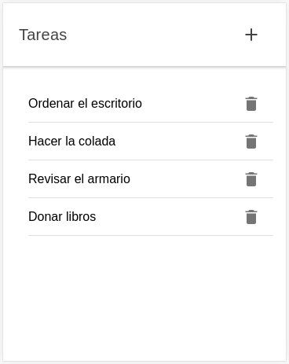
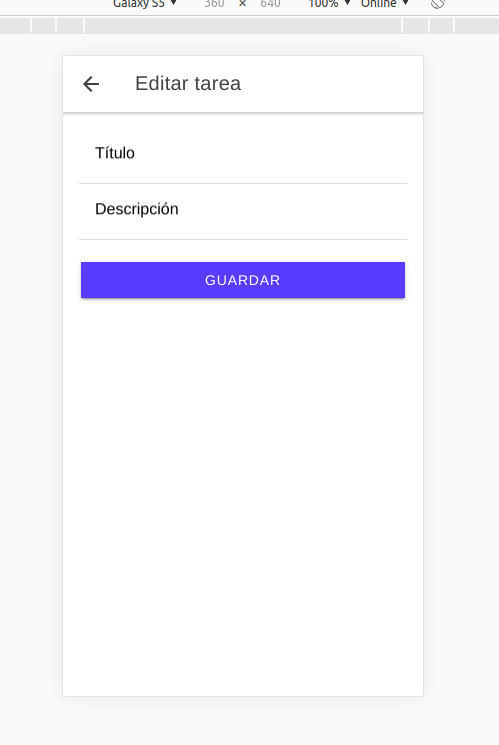
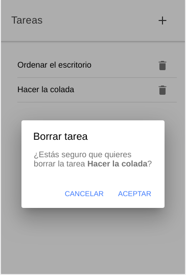

# Ionic todo list with Ionic Storage

Yo can create new tasks, edit, and delete them. Everything is saved with Ionic Storage.

To run the project:

```console
git clone https://github.com/LuisJoseSanchez/ionic-todo-list-with-ionic-storage.git
cd ionic-todo-list-with-ionic-storage
npm install
ionic serve
```

### Task list



### New task



### Edit task


### Delete task with confirmation


